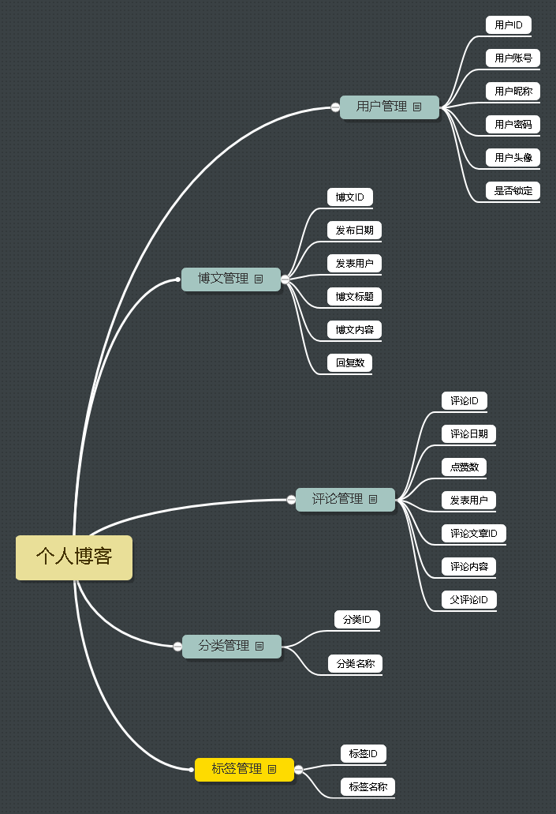

# 个人博客后台管理系统
## 一、系统描述
- 采用ssm框架,后台数据库使用mysql,可以满足增删改查博客,基本实现管理个人博客功能
提供了统计博客模块、发布博客模块、管理分类模块、管理标签模块、用户模块。
## 二、主要模块介绍
- 统计模块：统计博客、分类、标签的数量。
- 发布博客模块：系统将文章标题、内容、类型、标签、发表时间、博客ID录入数据库。
- 管理分类博客：提供删除分类的操作。
- 管理标签模块：提供删除标签的操作。
- 用户模块:修改昵称、账号、头像(不理想)
此次更新时间:2021年9月10日

